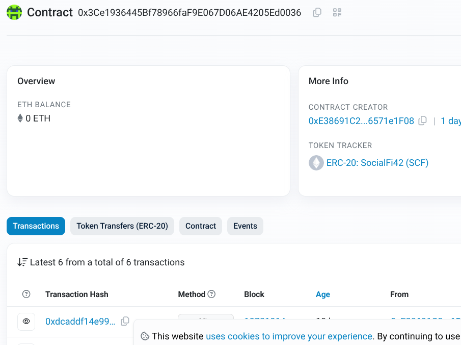

_this project is made by csalamit_

# ⬡ SocialFi42 — SCF Token

> A decentralized social media token built on Ethereum (Sepolia testnet).  
> Own your data. Own your value.

---

## 🔗 Contract

| Field | Value |
|-------|-------|
| **Network** | Ethereum Sepolia (testnet) |
| **Contract Address** | `0x3Ce1936445Bf78966faF9E067D06AE4205Ed0036` |
| **Standard** | ERC-20 |
| **Symbol** | SCF |
| **Decimals** | 18 |

🔍 [View on Etherscan](https://sepolia.etherscan.io/address/0x3Ce1936445Bf78966faF9E067D06AE4205Ed0036)




---

## 🌐 What is Ethereum & the Blockchain?

**Blockchain** is a public, decentralized ledger — a list of transactions recorded across thousands of computers simultaneously. No single entity controls it. Once a transaction is written, it cannot be altered.

**Ethereum** is a programmable blockchain. Unlike Bitcoin (which only records transfers of value), Ethereum lets developers deploy **smart contracts** — self-executing programs that live on-chain. When you call a function like `mint()` or `transfer()`, you're not calling a server: you're sending a transaction directly to code running on the blockchain.

**Key concepts:**
- 🧱 **Block** — a batch of transactions validated and added to the chain
- ⛽ **Gas** — the fee paid to the network to execute a transaction
- 🔑 **Private key** — your cryptographic identity; whoever holds it controls the wallet
- 📜 **Smart contract** — immutable code deployed at a fixed address on-chain
- 🧪 **Sepolia** — an Ethereum testnet; real network behavior, but fake ETH (free to use for development)

---

## 🚀 Frontend

The project includes a React interface (`Action.jsx`) to interact with the contract directly from the browser using MetaMask.

**Features:**
- Connect MetaMask wallet
- Check SCF token balance
- Transfer tokens to any address
- Mint new tokens (owner only)

```bash
npm install
npm run dev
```

> Make sure MetaMask is installed and connected to the **Sepolia** network.

---

## 🛠️ Interact via Terminal (Foundry / Cast)

### Mint tokens

```bash
cast send 0x3Ce1936445Bf78966faF9E067D06AE4205Ed0036 \
  "mint(address,uint256)" \
  <RECIPIENT_ADDRESS> \
  1000000000000000000 \
  --rpc-url $RPC_URL \
  --private-key $PRIVATE_KEY
```

> `1000000000000000000` = 1 SCF (18 decimals)

### Check balance

```bash
cast call 0x3Ce1936445Bf78966faF9E067D06AE4205Ed0036 \
  "balanceOf(address)(uint256)" \
  <WALLET_ADDRESS> \
  --rpc-url $RPC_URL
```

### Get fee history (Alchemy)

```bash
curl https://eth-sepolia.g.alchemy.com/v2/<YOUR_API_KEY> \
  --request POST \
  --header 'content-type: application/json' \
  --data '{
    "id": 1,
    "jsonrpc": "2.0",
    "method": "eth_feeHistory",
    "params": ["0x5", "latest", [20, 30]]
  }'
```

---

## 📄 Example Transaction

A successful `mint()` call on Sepolia:

```
transactionHash   0xe105c8fb2333e3b5f248357fa3c974c4e5ddd22a1907d5aa546da90f34b9151b
blockNumber       10729691
status            1 (success)
gasUsed           71251
effectiveGasPrice 123583724 wei
from              0xE38691C26030aAA5aA11f968dF80c876571e1F08
to                0x3Ce1936445Bf78966faF9E067D06AE4205Ed0036
```

---

## 📦 Environment Variables

Create a `.env` file at the root of your project:

```env
RPC_URL=https://eth-sepolia.g.alchemy.com/v2/<YOUR_API_KEY>
PRIVATE_KEY=<YOUR_PRIVATE_KEY>
```

> ⚠️ **Never commit your `.env` file.** Add it to `.gitignore`.

---

## 🗺️ Tokenomics

| Allocation | Share |
|------------|-------|
| User Rewards | 80% |
| Marketing | 10% |
| Treasury | 10% |

---

## 📜 License

Non-profit project by **csalamit** — 2026  
Built with ❤️ on Ethereum Sepolia.